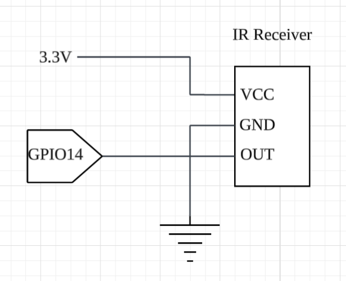

# 赤外線受信回路（RX）

## 概要
リモコン信号の解析・学習用として IR 受信モジュールを使用。

## 使用部品
| 部品 | 型番 / 種類 |
|------|-------------|
| IR受信モジュール | VS1838B |
| マイコン | ESP32 DevKit |

## 使用ピン
| 機能 | GPIO |
|------|------|
| IR受信 | GPIO14 |

## 接続方法

| 受信モジュール | ESP32 |
|---------------|-------|
| VCC | 3.3V |
| GND | GND |
| OUT | GPIO14 |

## 回路図

## 備考
- 38kHz 搬送波対応
