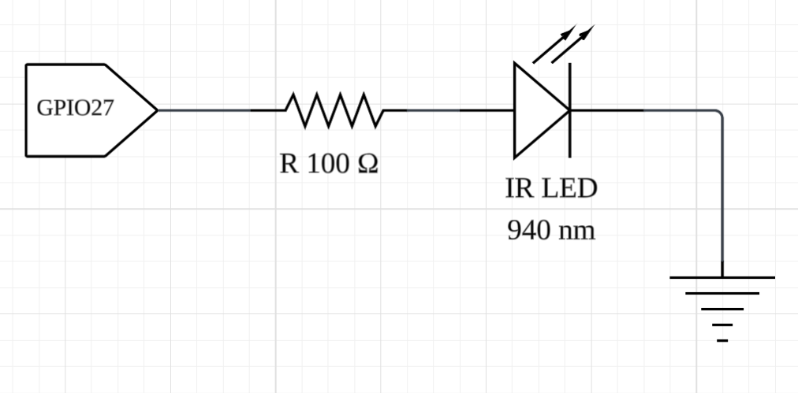

# 赤外線送信回路（TX）

## 概要
ESP32 の GPIO から赤外線LED（940nm）を駆動し、家電リモコン信号を送信する。

## 使用部品
| 部品 | 型番 / 種類 |
|------|-------------|
| 赤外線LED | 5mm IR LED 940nm |
| 抵抗 | 100Ω |
| マイコン | ESP32 DevKit |

## 使用ピン
| 機能 | GPIO |
|------|------|
| IR送信 | GPIO27 |

## 接続方法

GPIO27 → 100Ω抵抗 → IR LED アノード  
IR LED カソード → GND  

## 回路図

## 備考
- 搬送波は 38kHz
